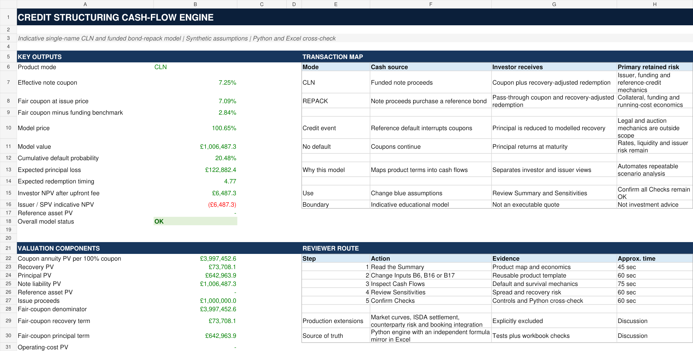

# Credit Structuring Lab

Credit Structuring Lab is a transparent Python cash-flow and scenario engine for a stylised single-name credit-linked note and a simple cash-pass-through bond repack. It converts an input term set into expected quarterly cash flows, indicative fair-coupon analytics, named scenarios, a spread and recovery sensitivity grid, validation checks, a SQLite run history and an Excel review pack.

The project is designed as an educational structuring workflow. It is not a production pricer, an executable quote or an implementation of legal credit-derivative definitions.



## What the engine covers

- A funded CLN note leg with quarterly coupons, recovery following default and principal redemption on survival
- A simple repack that compares expected reference-bond and note cash flows after an annual operating fee
- Constant hazard estimated with the market shorthand `credit spread / loss given default`
- Flat continuously compounded discounting and quarterly next-payment-date recovery settlement
- Named scenarios and a two-dimensional credit-spread and recovery sensitivity grid
- JSON, CSV, SQLite and Excel outputs with deterministic credit-event paths, automated validation and unit tests

Python is the calculation source of truth. The prebuilt workbook at [`excel/Credit_Structuring_Cash_Flow_Engine.xlsx`](excel/Credit_Structuring_Cash_Flow_Engine.xlsx) presents the model for review without requiring Python setup.

## Five-minute reviewer route

| Time | Review step | What it demonstrates |
|---|---|---|
| 0:00 to 0:45 | Read this page through the sample output | Product scope and commercial outputs |
| 0:45 to 2:00 | Open the prebuilt Excel workbook | Inputs, expected cash flows, sensitivities and checks in a familiar interface |
| 2:00 to 3:15 | Inspect [`src/credit_structuring_lab/model.py`](src/credit_structuring_lab/model.py) | Visible assumptions and reusable product logic |
| 3:15 to 4:15 | Review [`tests/test_model.py`](tests/test_model.py) and the CI workflow | Reconciliations, edge handling and version-controlled validation |
| 4:15 to 5:00 | Read [MODEL_NOTE.md](MODEL_NOTE.md) | Equations, economic interpretation and explicit limitations |

## Sample CLN output

The checked-in base case is a five-year, £1,000,000 CLN with a 7.25% coupon, 275 bp credit spread, 40% recovery assumption and 4.25% flat discount rate. Values below come from [`outputs/base_case_results.json`](outputs/base_case_results.json).

| Output | Base case |
|---|---:|
| Hazard rate | 4.583333% |
| Survival probability at maturity | 79.519599% |
| Cumulative default probability | 20.480401% |
| Indicative fair coupon | 7.087713% |
| Investor value per 100 notional | 100.648735 |
| Investor NPV | £6,487.35 |
| Validation checks | Passed |

The scenario summary shows how the fixed 7.25% note responds to different spread, recovery and discount assumptions.

| Scenario | Spread | Recovery | Fair coupon | Investor value per 100 |
|---|---:|---:|---:|---:|
| Base case | 275 bp | 40% | 7.0877% | 100.6487 |
| Tighter credit | 175 bp | 40% | 5.5516% | 107.1616 |
| Wider credit | 450 bp | 40% | 9.4112% | 92.0427 |
| Default stress | 700 bp | 20% | 12.4786% | 81.5260 |

These are model outputs under simplified assumptions. The probabilities are risk-neutral-style model quantities implied by the spread/LGD approximation, not forecasts.

## Sample repack output

The repack example uses a £1,000,000 reference bond purchased at 97.00, note proceeds of 97.50, a 5.25% reference coupon, a 5.10% note coupon and a 15 bp annual operating fee. Values come from [`outputs/repack_case_results.json`](outputs/repack_case_results.json).

| Output | Repack base case |
|---|---:|
| Reference-asset purchase | £970,000.00 |
| Note issue proceeds | £975,000.00 |
| Indicative zero-residual note coupon | 5.221549% |
| Investor value per 100 notional at 5.10% coupon | 96.029460 |
| Simplified issuer or SPV NPV at 5.10% coupon | £5,000.00 |
| Validation checks | Passed |

At the reported 5.221549% fair coupon, the model's simplified issuer or SPV NPV is zero. This target excludes external hedge, counterparty, legal and operational economics.

## Quick start

Python 3.10 or later is required. The core package uses only the Python standard library.

```bash
python -m venv .venv
source .venv/bin/activate
python -m pip install -e .
python -m unittest discover -s tests -v
```

Generate the CLN example.

```bash
python -m credit_structuring_lab generate \
  --input examples/base_case.json \
  --output-dir outputs
```

Generate the repack example without overwriting the CLN results.

```bash
python -m credit_structuring_lab generate \
  --input examples/repack_case.json \
  --output-dir outputs \
  --output-prefix repack_case
```

Compare recent stored base cases.

```bash
python -m credit_structuring_lab compare \
  --database outputs/model_runs.sqlite \
  --scenario "Base case" \
  --limit 10
```

The same commands can run directly from a checkout without installation by prefixing them with `PYTHONPATH=src`.

The same run history can be queried directly with SQLite.

```bash
sqlite3 outputs/model_runs.sqlite < sql/compare_runs.sql
```

## Inputs

Inputs are explicit JSON fields. Rates ending in `_pct` are percentages. Values ending in `_bps` are basis points. Prices are percentages of notional.

| Input group | Main fields |
|---|---|
| Structure | `mode`, `notional`, `term_years`, `payments_per_year`, `valuation_date` |
| Note | `issue_price_pct`, `coupon_rate_pct` |
| Credit | `credit_spread_bps`, `recovery_rate_pct` |
| Valuation | `discount_rate_pct`, `funding_rate_pct` |
| Repack | `reference_coupon_rate_pct`, `reference_price_pct`, `annual_fee_bps` |
| Analysis | `scenarios`, `sensitivity` |

This version accepts quarterly payments only. The term must resolve to a whole number of quarters.

## Method in brief

For spread \(s\) and recovery \(R\), the annual constant hazard rate is

\[
\lambda = \frac{s}{1-R}
\]

Survival and discount factors at time \(t\) are

\[
S(t)=e^{-\lambda t}, \qquad D(t)=e^{-rt}
\]

The probability of default during quarter \(i\) is \(S(t_{i-1})-S(t_i)\). A surviving note earns its scheduled coupon. A defaulting note receives recovery on the next payment date and earns no accrued coupon for that interval. A surviving note receives principal at maturity.

The CLN fair coupon sets investor NPV to zero at the stated issue price. The repack fair coupon sets the simplified issuer or SPV residual NPV to zero after the reference-asset purchase and operating fees. See [MODEL_NOTE.md](MODEL_NOTE.md) for the complete equations and interpretation.

## Outputs

The `generate` command writes these artefacts.

| Artefact | Purpose |
|---|---|
| `*_results.json` | Terms, methodology, base-case cash flows, scenarios, deterministic credit-event paths and validation |
| `*_sensitivity.csv` | Spread and recovery sensitivity grid |
| `model_runs.sqlite` | Normalised run and scenario history for comparison |
| `excel_crosscheck.json` | Machine-readable CLN values used to check workbook outputs |
| `excel/Credit_Structuring_Cash_Flow_Engine.xlsx` | Prebuilt reviewer-facing Excel model |

The SQLite layer uses parameterised queries and inserts each run with its scenario rows in one transaction. It exists to make run comparison reproducible rather than to simulate a production trade store.

## Validation

Every valuation reports model checks covering probability mass, non-increasing survival, quarterly schedule length, note cash-flow reconciliation, fair-coupon target NPV and finite numeric outputs. The test suite also covers spread directionality, credit-event settlement, invalid frequency handling, repack fair-coupon economics, SQLite ordering and CLI artefact generation.

Run all tests with

```bash
python -m unittest discover -s tests -v
```

GitHub Actions runs the same suite on supported Python versions for every push and pull request.

## Project tree

```text
credit-structuring-lab/
├── .github/workflows/ci.yml
├── excel/Credit_Structuring_Cash_Flow_Engine.xlsx
├── examples/
│   ├── base_case.json
│   └── repack_case.json
├── outputs/
│   ├── base_case_results.json
│   ├── excel_crosscheck.json
│   ├── model_runs.sqlite
│   └── sensitivity.csv
├── src/credit_structuring_lab/
│   ├── cli.py
│   ├── model.py
│   └── store.py
├── sql/compare_runs.sql
├── tests/test_model.py
├── tools/build_excel_model.mjs
├── MODEL_NOTE.md
├── README.md
└── pyproject.toml
```

## Scope boundaries

- The hazard rate is an approximation from one spread and recovery assumption, not a calibrated CDS term structure.
- Discounting uses one flat continuously compounded rate. There are no market curves, basis adjustments or liquidity premiums.
- Expected valuation cash flows are probability-weighted values. Separate deterministic payoff paths show default at 1.25, 3.00 and 4.75 years plus no default, but do not calculate XIRR or simulate a distribution of realised outcomes.
- Recovery settles on the next quarterly payment date. Legal determinations, auction settlement and restructuring mechanics are outside scope.
- The CLN issuer view covers issue proceeds and contractual note payments before external hedge, collateral, counterparty or funding economics.
- `funding_rate_pct` only decomposes note coupon into funding and credit-margin components. It does not model a secured-funding transaction.
- The repack is a simple cash-pass-through structure. It excludes swaps, collateral liquidation, waterfalls, margin calls and enforcement mechanics.
- Counterparty risk, wrong-way risk, CVA, FVA, MVA, regulatory capital, tax and accounting treatment are excluded.
- Outputs are indicative educational analytics. They are not production prices, investment advice or an offer to transact.

## CV-safe description

- Built a Python cash-flow engine for a stylised single-name credit-linked note and simple bond repack, linking reference-asset and investor-note cash flows under survival and credit-event scenarios.
- Automated credit-spread and recovery sensitivities with Excel reporting, reconciliation controls, unit tests, SQLite run comparison and a version-controlled Git workflow.

Use these bullets only when the repository, workbook and outputs are complete and reproducible.

## Licence

Released under the [MIT License](LICENSE).
